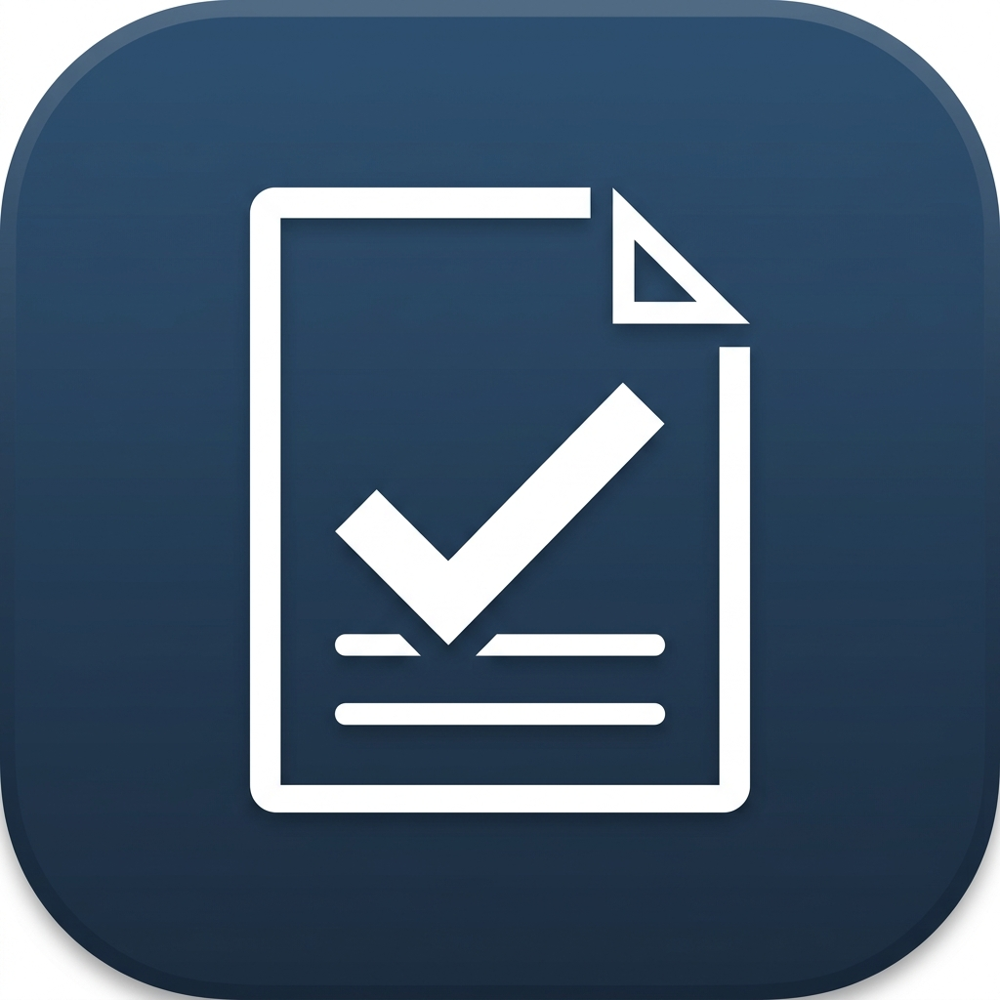
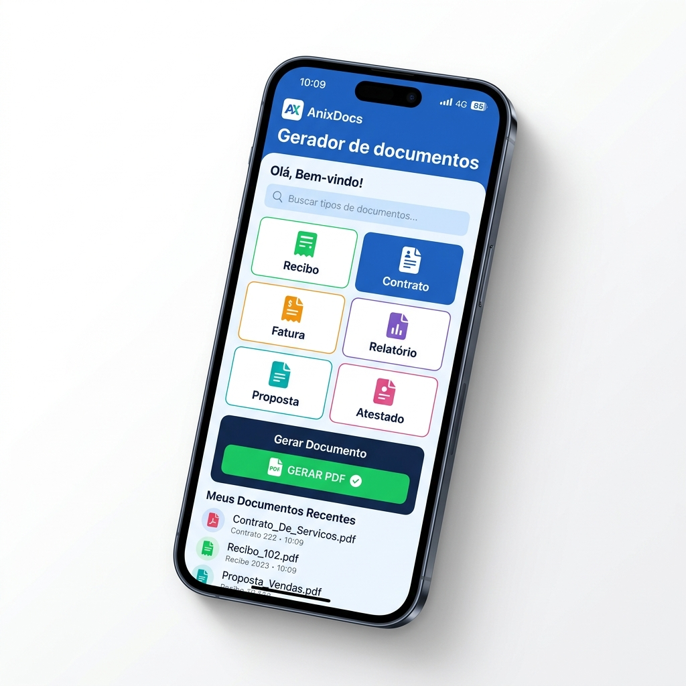

# 📝 Versão Final para a Google Play Store

Copie e cole as informações abaixo diretamente no Google Play Console.

### 🏷️ Título do Aplicativo (30 caracteres)
> `AnixDocs: Criar Recibo e PDF`

### 📄 Descrição Curta (80 caracteres)
> `Crie recibos, contratos e currículos profissionais em PDF. Rápido e fácil!`

### 📜 Descrição Longa (Otimizada para Busca)
`Simplifique sua burocracia com o AnixDocs! O aplicativo definitivo para gerar documentos profissionais em PDF direto do seu celular.`

`Precisa de um recibo urgente? Quer criar um contrato de aluguel ou um currículo impecável? Com o Gerador de Documentos Online Anix, você faz tudo em poucos minutos, paga via PIX e baixa o arquivo na hora.`

**✅ O que você pode criar:**
- Recibos de Pagamento e Aluguel 🏠
- Contratos de Locação e Prestação de Serviços 🤝
- Currículos Profissionais Modernos 💼
- Declarações de Residência e Hipossuficiência 📄
- Orçamentos e Termos de Vistoria 🛠️
- Projetos de União Estável e Autorização de Viagem ✈️

**🌟 Por que escolher o AnixDocs?**
- **Rapidez Imbatível**: Preencha os dados e gere o PDF em segundos.
- **Modelos Profissionais**: Documentos revisados e com visual limpo.
- **Praticidade Total**: Faça tudo pelo celular, de onde estiver.
- **Pagamento Seguro**: Liberação instantânea após o PIX.
- **Sem Assinatura**: Pague apenas pelo documento que gerar.

`Não perca tempo com modelos complicados do Word. Baixe o AnixDocs agora e tenha um escritório virtual no seu bolso!`

---

## 🎨 Galeria de Imagens (Screenshots)
Os mockups gerados para a loja estão disponíveis em:
- [Screenshot Home](file:///C:/Users/SERVIDOR%2002/.gemini/antigravity/brain/835d798e-1be6-472f-82a5-f7c486c35492/screenshot_home_1776443000576.png)
- [Screenshot Formulário](file:///C:/Users/SERVIDOR%2002/.gemini/antigravity/brain/835d798e-1be6-472f-82a5-f7c486c35492/screenshot_form_1776443022874.png)
- [Screenshot Sucesso](file:///C:/Users/SERVIDOR%2002/.gemini/antigravity/brain/835d798e-1be6-472f-82a5-f7c486c35492/screenshot_success_1776443045583.png)

---

## 2. Pesquisa de Palavras-Chave (Keywords)

Baseado no público brasileiro, estas são as palavras com maior "fit" para o seu app:

| Primárias (Alta Busca) | Secundárias (Nicho/Long Tail) |
| :--- | :--- |
| Gerador de Recibo | Recibo de Aluguel PDF |
| Criar Contrato | Modelo de Contrato Locação |
| Fazer Currículo | Documento de Vistoria Online |
| PDF Profissional | Declaração de Residência |
| Preencher Documento | Procuração Particular PDF |

---

## 3. Identidade Visual e Conversão (Ícone e Screenshots)

### Conceito de Ícone
O ícone deve ser simples e reconhecível em tamanhos pequenos.

*   **Símbolo**: Uma folha de papel com um sinal de "check" (✓).
*   **Cores**: Azul Profissional (#2c3e50).
*   **Estilo**: Minimalista e moderno.

### Screenshots (As "Telas" da Loja)
A sequência ideal deve focar no benefício direto. Gere telas que mostrem o resultado (o documento) e a facilidade de uso.

---

## Próximos Passos Sugeridos

1.  **Gerar Protótipos**: Use os conceitos acima como base para os artes finais.
2.  **Configurar PWA**: Se você ainda não publicou como app, podemos configurar o `manifest.json` para que ele seja instalável no celular.
